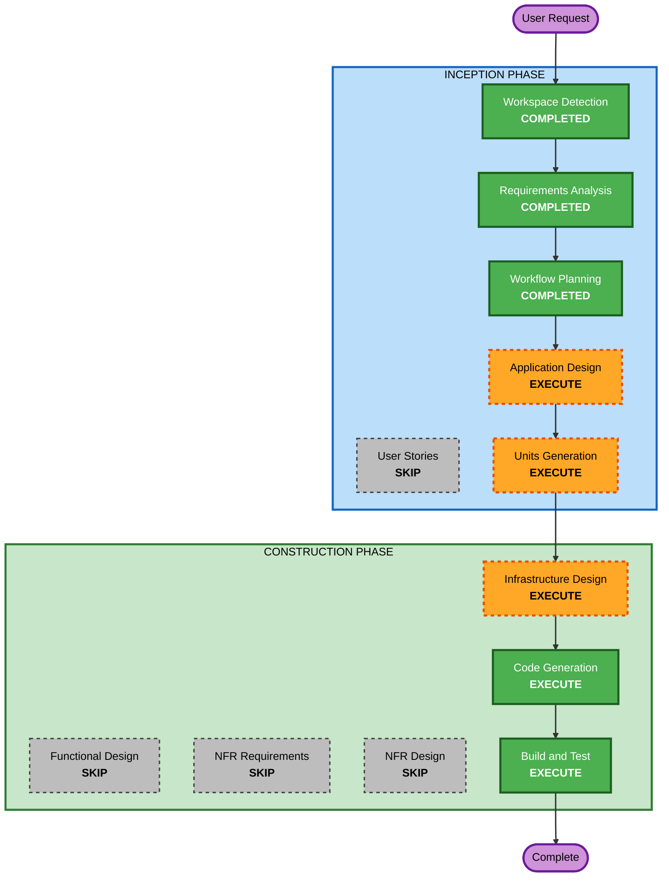

# Execution Plan

## Detailed Analysis Summary

### Change Impact Assessment
- **User-facing changes**: Yes — REST APIs, demo endpoints
- **Structural changes**: Yes — entire new microservices architecture
- **Data model changes**: Yes — DynamoDB table with GSI
- **API changes**: Yes — 3 services with REST APIs
- **NFR impact**: Yes — observability, intentional weaknesses, alarms

### Risk Assessment
- **Risk Level**: Medium (demo project, not production)
- **Rollback Complexity**: Easy (greenfield, can redeploy)
- **Testing Complexity**: Moderate (3 services, infrastructure)

## Workflow Visualization

## Phases to Execute

### INCEPTION PHASE
- [x] Workspace Detection (COMPLETED)
- [x] Requirements Analysis (COMPLETED)
- [ ] User Stories - SKIP
  - **Rationale**: Demo project with no real user personas; requirements already implementation-ready
- [x] Workflow Planning (IN PROGRESS)
- [ ] Application Design - EXECUTE
  - **Rationale**: 3 new services + infrastructure need component identification and service layer design
- [ ] Units Generation - EXECUTE
  - **Rationale**: System decomposes into multiple units (3 services + infrastructure + CI/CD + supporting files)

### CONSTRUCTION PHASE
- [ ] Functional Design - SKIP
  - **Rationale**: Business logic is simple and fully specified in requirements (each service <200 lines)
- [ ] NFR Requirements - SKIP
  - **Rationale**: NFRs already defined in requirements (observability, intentional weaknesses are specified)
- [ ] NFR Design - SKIP
  - **Rationale**: NFR Requirements skipped; patterns are straightforward (structured logging, X-Ray)
- [ ] Infrastructure Design - EXECUTE
  - **Rationale**: CDK stacks with 4 stack types, multiple AWS services, alarm design needs specification
- [ ] Code Generation - EXECUTE (ALWAYS)
  - **Rationale**: Implementation of all units
- [ ] Build and Test - EXECUTE (ALWAYS)
  - **Rationale**: Build, test, and verification instructions needed

### OPERATIONS PHASE
- [ ] Operations - PLACEHOLDER

## Success Criteria
- **Primary Goal**: Working demo application that showcases all 10 DevOps Agent demo scenarios
- **Key Deliverables**: 3 microservices, CDK infrastructure, CI/CD pipelines, load tests, demo branches, DevOps Agent config files
- **Quality Gates**: Each service <200 lines, intentional weaknesses clearly commented, all 10 demo scenarios supportable

## Explicit Deliverables for Demo Scenarios

### Demo Branches (FR-09)
- **demo/bad-change**: Branch with error handling removed from order-service + unencrypted S3 bucket added (Release Manager PRR Gate demo)
- **demo/add-discount**: Branch with new discount logic in order-service (Autonomous Release Testing demo)
- These branches are created during Code Generation as part of the unit that owns order-service

### DevOps Agent Config Files
- **.devopsagent/skills/circuit-breaker-playbook.md** — Custom Skill for mitigation (Demo 4/5)
- **.devopsagent/knowledge/architecture-rules.md** — Knowledge Items (Demo 5)
- **.devopsagent/standards/release-standards.md** — PRR Gate evaluation standards (Demo 6)
- **.devopsagent/agents/capacity-check.yaml** — Scheduled workflow Custom Agent (Demo 9)

### Kiro Integration (FR-12)
- README instructions for connecting Kiro to DevOps Agent via Remote MCP + Personal Access Token (Demo 8/10)

### MonitoringStack Design Constraint (FR-13)
- **CRITICAL**: Both p99 latency alarm AND error rate alarm MUST be on order-service (not payment-service)
- When payment-service times out, order-service p99 increases AND order-service error rate increases
- This ensures a single upstream failure triggers 2+ distinct alarms on the SAME service → Triage Agent detects duplicate (Demo 3)
